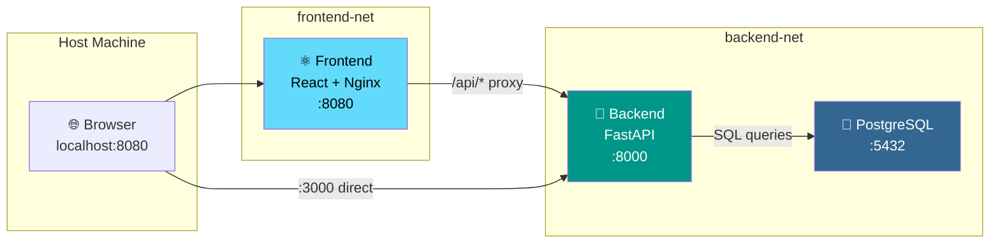

<div align="center">

# 📋 DevBoard

### Modern Kanban Board for Task Management

[](https://github.com/USERNAME/devboard/actions)
[](LICENSE)
[](https://www.python.org/)
[](https://react.dev/)
[](https://www.postgresql.org/)
[](https://podman.io/)

**DevBoard** is a fullstack Kanban board application where users can create boards, columns, and task cards to manage their workflow. Built with modern technologies and containerized for one-command deployment.

[Quick Start](#-quick-start) · [API Docs](#-api-documentation) · [Architecture](#-architecture) · [Contributing](#-contributing)

</div>

---

## ✨ Features

- 🔐 **User Authentication** — Register & login with JWT tokens
- 📋 **Board Management** — Create, rename, and delete boards
- 📊 **Kanban Columns** — Default columns (To Do, In Progress, Done) with custom columns support
- 🎯 **Task Cards** — Create, edit, move, and delete tasks between columns
- 🎨 **Modern UI** — Clean, responsive interface built with React & Tailwind CSS
- 🐳 **One-Command Deploy** — Fully containerized with Podman Compose
- 📖 **Auto-Generated API Docs** — Swagger UI powered by FastAPI
- 🔒 **Rootless Containers** — Secure, rootless Podman deployment

---

## 🚀 Quick Start

### Prerequisites

- [Podman](https://podman.io/getting-started/installation) (v4.0+)
- [Podman Compose](https://github.com/containers/podman-compose) (`pip install podman-compose`)

### Launch

```bash
# Clone the repository
git clone https://github.com/USERNAME/devboard.git
cd devboard

# Start all services
podman-compose up -d

# Open in browser
# Frontend: http://localhost:8080
# API Docs: http://localhost:3000/api/docs
```

That's it! 🎉 The application is ready to use.

### Demo Account

A demo user is pre-seeded for quick exploration:

| Field | Value |
|-------|-------|
| Username | `demo_user` |
| Password | `demo1234` |

---

## 🏗 Architecture



### Network Isolation

| Service | Networks | Exposed Ports |
|---------|----------|---------------|
| **Frontend** | `frontend-net` | `8080` → Host |
| **Backend** | `frontend-net` + `backend-net` | `3000` → Host |
| **PostgreSQL** | `backend-net` only | None (internal) |

> PostgreSQL is completely hidden from the host machine — accessible only by the backend service through the internal network.

---

## 🛠 Tech Stack

| Layer | Technology | Purpose |
|-------|-----------|---------|
| **Frontend** | React 18 + Vite | SPA with modern build tooling |
| **Styling** | Tailwind CSS v4 | Utility-first CSS framework |
| **Backend** | Python 3.12 + FastAPI | High-performance async API |
| **ORM** | SQLAlchemy 2.0 | Database models & queries |
| **Database** | PostgreSQL 16 | Reliable relational storage |
| **Auth** | JWT (python-jose) | Stateless authentication |
| **Containers** | Podman + Compose | Rootless container orchestration |
| **CI/CD** | GitHub Actions | Automated linting & builds |

---

## 📡 API Documentation

FastAPI provides interactive API documentation out of the box:

- **Swagger UI**: [http://localhost:3000/api/docs](http://localhost:3000/api/docs)
- **ReDoc**: [http://localhost:3000/api/redoc](http://localhost:3000/api/redoc)

### Endpoints Overview

| Method | Endpoint | Description |
|--------|----------|-------------|
| `POST` | `/api/auth/register` | Register a new user |
| `POST` | `/api/auth/login` | Login and get JWT token |
| `GET` | `/api/auth/me` | Get current user profile |
| `GET` | `/api/boards` | List user's boards |
| `POST` | `/api/boards` | Create a new board |
| `GET` | `/api/boards/{id}` | Get board with columns & tasks |
| `PUT` | `/api/boards/{id}` | Update board title |
| `DELETE` | `/api/boards/{id}` | Delete a board |
| `POST` | `/api/boards/{id}/columns` | Add column to board |
| `PUT` | `/api/columns/{id}` | Update column |
| `DELETE` | `/api/columns/{id}` | Delete column |
| `POST` | `/api/columns/{id}/tasks` | Create task in column |
| `PUT` | `/api/tasks/{id}` | Update task |
| `DELETE` | `/api/tasks/{id}` | Delete task |
| `PATCH` | `/api/tasks/{id}/move` | Move task to another column |
| `GET` | `/api/health` | Health check |

---

## 📁 Project Structure

```
devboard/
├── .github/
│   ├── ISSUE_TEMPLATE/          # Bug report & feature request templates
│   ├── workflows/ci.yml         # CI pipeline (lint + build)
│   └── PULL_REQUEST_TEMPLATE.md # PR checklist
├── frontend/
│   ├── src/
│   │   ├── components/          # Reusable UI & Kanban components
│   │   ├── features/            # Auth & board feature modules
│   │   └── lib/                 # API client & auth context
│   ├── nginx.conf               # Production reverse proxy config
│   └── Containerfile            # Multi-stage build (~30MB image)
├── backend/
│   ├── src/
│   │   ├── app/
│   │   │   ├── auth/            # JWT authentication module
│   │   │   ├── boards/          # Board CRUD operations
│   │   │   ├── columns/         # Column management
│   │   │   ├── tasks/           # Task CRUD & movement
│   │   │   ├── models.py        # SQLAlchemy 2.0 models
│   │   │   └── main.py          # FastAPI application
│   │   └── tests/               # Pytest test suite
│   ├── requirements.txt
│   └── Containerfile            # Multi-stage build (~150MB image)
├── database/
│   ├── init.sql                 # Schema migrations
│   └── seed.sql                 # Demo data
├── podman-compose.yml           # Container orchestration
├── .env.example                 # Environment template
└── README.md
```

---

## 🧪 Development

### Running Locally (without containers)

```bash
# Backend
cd backend
python -m venv .venv && source .venv/bin/activate
pip install -r requirements.txt
uvicorn src.app.main:app --reload --port 8000

# Frontend (in another terminal)
cd frontend
npm install
npm run dev
```

### Running Tests

```bash
cd backend
python -m pytest src/tests/ -v
```

### Linting

```bash
# Backend
cd backend && ruff check . && ruff format --check .

# Frontend
cd frontend && npm run lint
```

---

## 🤝 Contributing

Contributions are welcome! Please check out our:

- [Bug Report Template](.github/ISSUE_TEMPLATE/bug_report.md)
- [Feature Request Template](.github/ISSUE_TEMPLATE/feature_request.md)
- [Pull Request Template](.github/PULL_REQUEST_TEMPLATE.md)

### Commit Convention

This project follows [Conventional Commits](https://www.conventionalcommits.org/):

```
feat: add kanban board drag-and-drop
fix: resolve database connection timeout
docs: update README with API endpoints
chore: update frontend dependencies
```

---

## 📄 License

This project is licensed under the MIT License — see the [LICENSE](LICENSE) file for details.

---

<div align="center">

**Built with ❤️ using React, FastAPI, PostgreSQL, and Podman**

</div>
